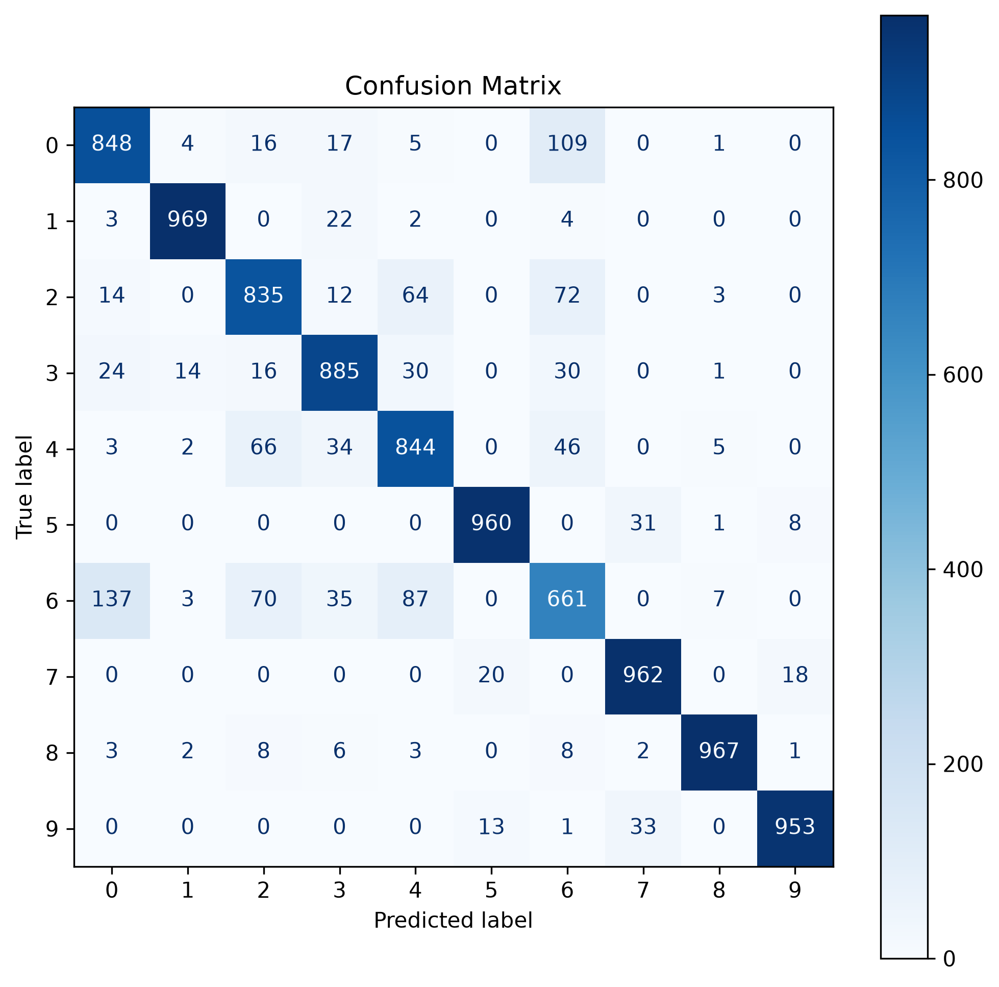
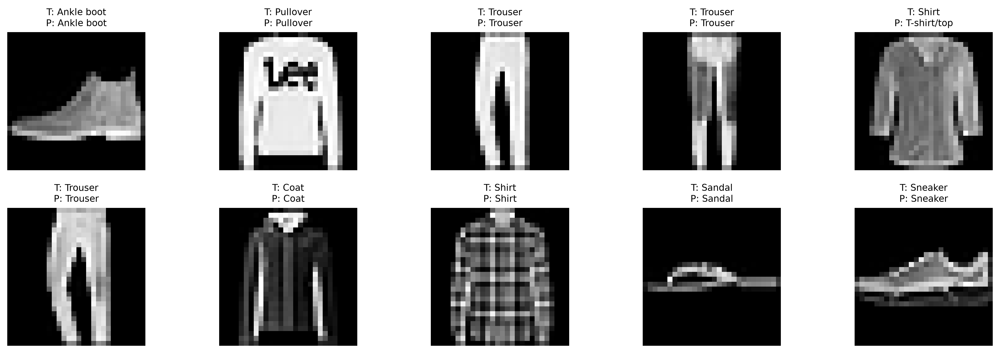

<div align="center">

# 👗 Fashion MNIST Image Classifier

### HOG Feature Extraction + Linear SVM

[](https://www.python.org/)
[](https://scikit-learn.org/)
[](https://opencv.org/)
[](LICENSE)

[](https://github.com/SoumiryaSarangi/Image-Classifier-for-fashion-mnist-hog-svm)
[](https://github.com/SoumiryaSarangi/Image-Classifier-for-fashion-mnist-hog-svm)
[](https://github.com/SoumiryaSarangi/Image-Classifier-for-fashion-mnist-hog-svm)

<br/>

A high-performance image classification pipeline that classifies **Fashion MNIST** images using **Histogram of Oriented Gradients (HOG)** feature extraction and a **Linear Support Vector Machine (SVM)** — built with a clean, modular Python architecture.

[Getting Started](#-installation) · [Usage Guide](#-usage-guide) · [Evaluation](#-evaluation-metrics) · [Contributing](#-contributing)

<br/>


</div>

---

## 📋 Table of Contents

- [Project Overview](#-project-overview)
- [Features](#-features)
- [Technologies Used](#-technologies-used)
- [Folder Structure](#-folder-structure)
- [Installation](#-installation)
- [Requirements](#-requirements)
- [How to Run](#-how-to-run)
- [Usage Guide](#-usage-guide)
- [Evaluation Metrics](#-evaluation-metrics)
- [Screenshots](#-screenshots)
- [Future Improvements](#-future-improvements)
- [License](#-license)
- [Author](#-author)

---

## 🔍 Project Overview

Fashion MNIST is a dataset of **Zalando's article images** consisting of **70,000 grayscale images** (28×28 pixels) across **10 fashion categories**. This project implements a complete machine learning pipeline to classify these images using classical computer vision techniques.

### 🎯 How It Works

```
Input Image (28×28) → Preprocessing → HOG Feature Extraction → Linear SVM → Predicted Class
```

| Step | Description |
|------|-------------|
| **1. Load Data** | Fetches Fashion MNIST via `tensorflow.keras.datasets` |
| **2. Preprocess** | Normalizes pixel values to `[0, 1]` and reshapes with channel dimension |
| **3. Extract HOG** | Computes Histogram of Oriented Gradients (4×4 px/cell, 2×2 cells/block) |
| **4. Train SVM** | Fits a Linear SVM on the extracted HOG feature vectors |
| **5. Evaluate** | Generates accuracy, confusion matrix, and classification report |
| **6. Predict** | Classifies custom images via the interactive CLI |

### 🏷️ Supported Classes

| Label | Class | Label | Class |
|:-----:|-------|:-----:|-------|
| 0 | T-shirt/top | 5 | Sandal |
| 1 | Trouser | 6 | Shirt |
| 2 | Pullover | 7 | Sneaker |
| 3 | Dress | 8 | Bag |
| 4 | Coat | 9 | Ankle boot |

---

## ✨ Features

<table>
<tr>
<td>

### 🏗️ Architecture
- Modular Python package structure
- Separate modules for each pipeline stage
- Clean separation of concerns

### 🧠 Machine Learning
- HOG feature extraction (`skimage`)
- Linear SVM classifier (`scikit-learn`)
- Train & test accuracy reporting

### 💾 Persistence
- Model saving/loading via `joblib`
- HOG feature caching to avoid recomputation
- Automatic detection of saved artifacts

</td>
<td>

### 📊 Evaluation
- Confusion Matrix visualization
- Classification Report generation
- Precision, Recall & F1-score per class
- Auto-saving of all evaluation outputs

### 🖼️ Prediction
- Custom image prediction via CLI
- OpenCV-based image preprocessing
- Prediction visualization grid

### 🖥️ Interface
- Interactive command-line menu
- Clean console output formatting
- Guided user prompts

</td>
</tr>
</table>

---

## 🛠️ Technologies Used

| Category | Technology | Version |
|----------|-----------|---------|
| **Language** |  Python | `3.10+` |
| **ML Framework** |  scikit-learn | `1.9.0` |
| **Computer Vision** |  OpenCV | `5.0.0` |
| **Feature Extraction** |  scikit-image | `0.26.0` |
| **Data Handling** |  NumPy | `2.5.1` |
| **Visualization** |  Matplotlib | `3.11.1` |
| **Dataset Source** |  TensorFlow (Keras) | `2.21.0` |
| **Serialization** |  Joblib | `1.5.3` |

---

## 📁 Folder Structure

```
Fashion-MNIST-HOG-SVM/
│
├── 📄 main.py                        # Entry point — orchestrates the full pipeline
├── 📄 requirements.txt               # Python dependencies
├── 📄 README.md                      # Project documentation (you are here!)
│
├── 📂 src/                            # Source package
│   ├── __init__.py                    # Package initializer
│   ├── dataset.py                     # Fashion MNIST data loading
│   ├── preprocessing.py               # Normalization & reshaping
│   ├── features.py                    # HOG feature extraction
│   ├── model.py                       # SVM training, evaluation & persistence
│   ├── predict.py                     # Custom image prediction pipeline
│   ├── visualize.py                   # Sample & prediction visualizations
│   └── cache.py                       # HOG feature caching utilities
│
├── 📂 models/                         # Serialized artifacts
│   ├── image_classifier.joblib        # Trained SVM model
│   ├── train_hog.joblib               # Cached training HOG features
│   └── test_hog.joblib                # Cached testing HOG features
│
├── 📂 outputs/                        # Evaluation outputs
│   ├── confusion_matrix.png           # Confusion matrix heatmap
│   ├── classification_report.txt      # Per-class metrics report
│   └── predictions.png               # Prediction visualization grid
│
└── 📂 images/                         # Custom images for prediction
    ├── bag.png
    └── shoes.png
```

---

## ⚙️ Installation

### Prerequisites

- **Python 3.10** or higher
- **pip** package manager
- **Git** (optional, for cloning)

### Steps

**1. Clone the repository**

```bash
git clone https://github.com/SoumiryaSarangi/Image-Classifier-for-fashion-mnist-hog-svm.git
cd Image-Classifier-for-fashion-mnist-hog-svm
```

**2. Create a virtual environment** _(recommended)_

```bash
python -m venv .venv
```

**3. Activate the virtual environment**

```bash
# Windows
.venv\Scripts\activate

# macOS / Linux
source .venv/bin/activate
```

**4. Install dependencies**

```bash
pip install -r requirements.txt
```

---

## 📦 Requirements

The core dependencies for this project:

```
tensorflow>=2.21.0
scikit-learn>=1.9.0
scikit-image>=0.26.0
opencv-python>=5.0.0
numpy>=2.5.1
matplotlib>=3.11.1
joblib>=1.5.3
pillow>=12.3.0
```

> [!NOTE]
> TensorFlow is used **only** for loading the Fashion MNIST dataset via `keras.datasets`. The classification itself is fully powered by scikit-learn.

---

## 🚀 How to Run

```bash
python main.py
```

On first run, the pipeline will:

1. 📥 Download the Fashion MNIST dataset (automatic via Keras)
2. 🔄 Preprocess images (normalize + reshape)
3. 📐 Extract HOG features (and cache them for future runs)
4. 🧠 Train the Linear SVM classifier (and save the model)
5. 📋 Present the interactive menu

On subsequent runs, cached HOG features and the saved model are **loaded automatically**, making startup significantly faster.

---

## 📖 Usage Guide

After launching the program, you'll see the interactive menu:

```
Choose an option:
1. Evaluate Model
2. Predict Custom Image
3. Exit
```

### Option 1 — Evaluate Model

Runs the trained model against both training and testing sets:

- Prints **training accuracy** and **testing accuracy**
- Displays the **confusion matrix** as a heatmap
- Generates and saves the **classification report**
- Shows a **prediction visualization** grid (true vs. predicted labels)

All evaluation outputs are automatically saved to the `outputs/` directory.

### Option 2 — Predict Custom Image

Provide the path to any fashion image:

```
Enter image path: images/shoes.png
```

The pipeline will:
1. Load and convert the image to grayscale
2. Resize to 28×28 pixels
3. Normalize and extract HOG features
4. Predict the fashion category
5. Display the image with the prediction

> [!TIP]
> For best results, use images with a **clean background** and a **single centered item**. The model was trained on 28×28 grayscale images, so high-contrast images work best.

### Option 3 — Exit

Cleanly exits the program.

---

## 📊 Evaluation Metrics

The model is evaluated using industry-standard classification metrics:

| Metric | Description |
|--------|-------------|
| **Accuracy** | Overall ratio of correct predictions |
| **Precision** | How many selected items are relevant (per class) |
| **Recall** | How many relevant items are selected (per class) |
| **F1-Score** | Harmonic mean of Precision and Recall |
| **Confusion Matrix** | Visual breakdown of predictions vs. true labels |

### Sample Classification Report

```
              precision    recall  f1-score   support

           0     0.8425    0.8560    0.8492      1000
           1     0.9890    0.9710    0.9799      1000
           2     0.8119    0.8360    0.8238      1000
           3     0.8871    0.8950    0.8910      1000
           4     0.8089    0.8370    0.8227      1000
           5     0.9721    0.9570    0.9645      1000
           6     0.7214    0.6830    0.7017      1000
           7     0.9393    0.9620    0.9505      1000
           8     0.9754    0.9720    0.9737      1000
           9     0.9542    0.9540    0.9541      1000

    accuracy                         0.8923     10000
   macro avg     0.8902    0.8923    0.8911     10000
weighted avg     0.8902    0.8923    0.8911     10000
```

> [!NOTE]
> Results may vary slightly depending on system and library versions. The metrics above are representative of a typical run.

---

## 📸 Screenshots

<details>
<summary><b>🖼️ Click to expand screenshots</b></summary>

<br/>

### Confusion Matrix

> The confusion matrix is saved to `outputs/confusion_matrix.png` after evaluation.



### Prediction Visualization

> True labels vs. predicted labels for sample test images, saved to `outputs/predictions.png`.



### Classification Report

The detailed classification report can be found here.


</details>

> [!TIP]
> Run **Option 1 (Evaluate Model)** to generate all screenshot outputs automatically in the `outputs/` directory.

---

## 🔮 Future Improvements

- [ ] 🌐 Add a web-based UI using Streamlit or Gradio
- [ ] 🔧 Hyperparameter tuning with GridSearchCV / RandomizedSearchCV
- [ ] 📈 Experiment with RBF / Polynomial SVM kernels
- [ ] 🧪 Cross-validation for more robust evaluation
- [ ] 🧹 Data augmentation (rotation, flip, noise)
- [ ] 📦 Docker containerization for reproducibility
- [ ] 🤖 Compare with CNN-based approaches (TensorFlow / PyTorch)
- [ ] 📊 Add ROC-AUC curves and per-class visualizations
- [ ] ⚡ GPU-accelerated HOG extraction
- [ ] 🧬 Experiment with PCA dimensionality reduction before SVM

---

## 📄 License

This project is licensed under the **MIT License** — see the [LICENSE](LICENSE) file for details.

```
MIT License

Copyright (c) 2026 Soumirya Sarangi

Permission is hereby granted, free of charge, to any person obtaining a copy
of this software and associated documentation files (the "Software"), to deal
in the Software without restriction, including without limitation the rights
to use, copy, modify, merge, publish, distribute, sublicense, and/or sell
copies of the Software, and to permit persons to whom the Software is
furnished to do so, subject to the following conditions:

The above copyright notice and this permission notice shall be included in all
copies or substantial portions of the Software.
```

---

## 👤 Author

<table>
<tr>
<td align="center">

**Soumirya Sarangi**

[](https://github.com/SoumiryaSarangi)


</td>
</tr>
</table>

---

<div align="center">

### ⭐ If you found this project helpful, please consider giving it a star!

Made with ❤️ and Python

[](https://forthebadge.com)
[](https://forthebadge.com)

</div>
